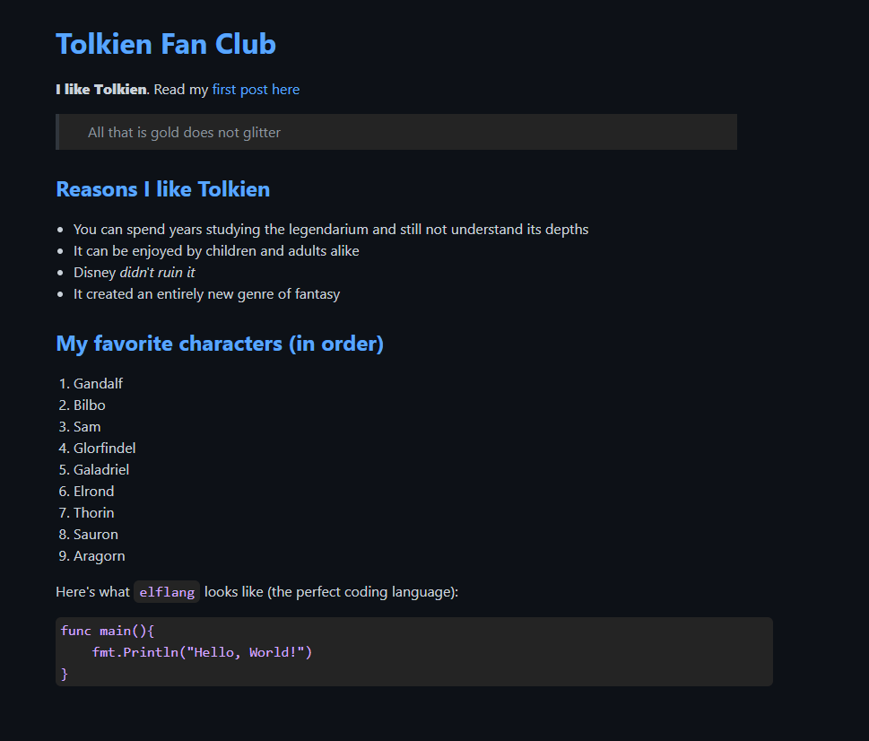

# Static Site Generator

## Description

A static site generator takes raw content files (like Markdown and images) and turns them into a static website (a mix of HTML and CSS files).

## Technologies Used

- **Backend**:

  - Native Python

- **Deployment**:

  - Use the main.sh script to start the server, default port is set to 8888. This script executes main.py which removes the public folder and creates a new version based on the content in the static folder as well as content.

## Try my app

1. You can try the app by cloning the repo locally and executing the main.sh or you can run my preconfigured tests using test.sh, make sure you have python3 installed

## Visual reference of project

The following images demonstrates the webpage's appearance based on the content provided:

### Image one

### Image two

## License

This project uses the MIT license.
